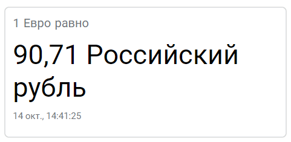
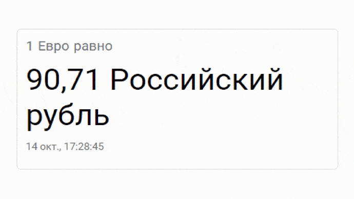

# CurrentRate Module
This project was generated with Angular 10.

## Preview
The request is sent every 10 seconds.

## Start the project
Execute command `npm run start` for a dev server. Navigate to `http://localhost:4200/`.

## About
This project is the module, which shows current exchange rate of euro to rubles.
The request is sent to CBR API every 10 seconds.
Modular approach was selected for convenient reuse.
This module can be easily added to any project.
